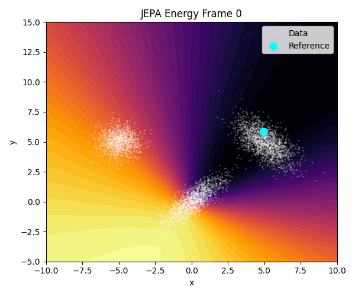

# 🧠 Recap: Self-Supervised Learning on 2D Mixture of Gaussians (MoG)

We've explored several self-supervised and generative learning approaches, each offering a different way to model or understand data geometry. Here's a structured summary of what we've done.

---

## ✅ 1. Joint Embedding Training with Contrastive Loss

**Goal**: Learn an embedding space where similar points (e.g., perturbed versions of the same sample) are close, and dissimilar points are far apart.

[Reference paper](https://arxiv.org/pdf/1807.03748)

### What We Did
- Sampled pairs: `(x, x')` where `x'` is a perturbed version of `x`.
- Trained a 2-layer MLP encoder.
- Applied **contrastive loss**, such as cosine similarity:
  - Pull `x` and `x'` together.
  - Push `x` and unrelated `x''` apart.

### Key Traits
- Encourages **local structure awareness**.
- Effective at separating clusters.
- Visualization: **energy landscape = -cosine similarity**.

### Outcome
- Learned well-separated embeddings for different clusters.
- Strong energy wells around data points.
- Contrastive loss required **careful batch construction**.

---

## ✅ 2. Denoising Score Matching (DSM)

[Reference paper](https://jmlr.org/papers/volume6/hyvarinen05a/hyvarinen05a.pdf)

**Goal**: Estimate the **gradient of the log density** (a.k.a. the score function):
\[
\nabla_x \log p(x)
\]

### What We Did
- Added Gaussian noise: \(\tilde{x} = x + \epsilon\).
- Trained a network to predict: \(-\epsilon / \sigma^2\).
- Used MSE between predicted vector and true noise direction.

### Key Traits
- Trains without contrastive or positive/negative pairs.
- Approximates **score function** of the data distribution.
- Enables **sampling** via Langevin dynamics.

### Outcome
- Model learned to point toward data clusters.
- Energy can be high outside, low near data or vice versa.
- Captures local structure and partially long-range geometry.

---

## ✅ 3. JEPA (Joint Embedding Predictive Architectures)

[Reference paper](https://openreview.net/pdf?id=BZ5a1r-kVsf)

**Goal**: Predict embeddings of perturbed samples without using contrastive loss.

### a. Basic JEPA
- Input: `(x, x')`, where `x' = x + noise`.
- Learn embeddings `f(x)` and `f(x')`.
- Minimize: \(\| f(x) - f(x') \|^2\)

### b. Global Pairwise JEPA
- Compare every `x_i` to **all** `x'_j` in batch:
\[
\mathcal{L} = \sum_{i,j} \| f(x_i) - f(x'_j) \|^2
\]
- Learns a **non-local similarity structure**.

### c. Masked JEPA
- Randomly mask one coordinate (`x[0]` or `x[1]`).
- Predict embedding of full point from masked input.
- Alternated mask per epoch.
- [Paper](https://arxiv.org/pdf/2301.08243)

### d. EMA-Based JEPA (BYOL-style)
- Online encoder: `f(x)` (trainable).
- Target encoder: `f'(x')` (updated via exponential moving average).
- Loss: match embeddings.
- [Paper](https://arxiv.org/pdf/2006.07733)

### Key Traits
- No contrastive terms needed.
- EMA improves stability and avoids collapse.
- Masked JEPA encourages conditional modeling.
- Pairwise JEPA promotes global geometry learning.

### Outcome
- Learned smooth, local or global energy structures.
- Less collapse, especially with EMA.
- Masked variant captured **conditional dependencies**.

---

## 📊 Summary Table

| Method           | Uses Contrastive? | Learns Score? | Sampling? | Learns Global Structure? | Masked Prediction? |
|------------------|-------------------|----------------|-----------|----------------------------|----------------------|
| Contrastive JEA  | ✅ Yes            | ❌ No         | ❌        | ⚠️ Local only             | ❌                   |
| DSM              | ❌ No             | ✅ Yes        | ✅        | ❌ Local only              | ❌                   |
| Global Pairwise JEPA | ❌ No         | ❌ No         | ❌        | ✅ Yes                     | ❌                   |
| Masked JEPA      | ❌ No             | ❌ No         | ❌        | ⚠️ Some global awareness   | ✅                   |
| JEPA + EMA       | ❌ No             | ❌ No         | ❌        | ✅ Stable + non-local      | Optional             |

---

# 🔬 Experiments on the MNIST dataset

## 1. **Data Perturbation**  
   - **Goal**: Apply various transformations (affine, erosion, dilation, inversion, and noise) to perturb MNIST images.  
   - **Method**: Uses random transformations like rotations, scaling, shearing, and random noise to alter the images.

## 2. **Phase 1: JEPA Embedding Training**  
   - **Goal**: Train a model to generate robust latent representations (embeddings) using perturbation-based self-supervised learning.  
   - **Method**: The model learns to predict representations of perturbed images using cosine similarity loss.  
   - **Evaluation**: Embeddings visualized using PCA and evaluated with k-NN accuracy.

### k-NN Evaluation (k=5):

- **Accuracy**:  0.9901
- **Precision**: 0.9901
- **Recall**:    0.9901
- **F1 Score**:  0.9901

## 3. **Phase 2: Reconstruction Fine-Tuning**  
   - **Goal**: Fine-tune the model for image reconstruction using a decoder.  
   - **Method**: The model, after training embeddings, reconstructs perturbed images and optimizes using MSE loss.  
   - **Evaluation**: Visual comparison of original, perturbed, and reconstructed images.

# 💫 System identification experiments

**Paper:** *VJEPA: Variational Joint Embedding Predictive Architectures as Probabilistic World Models*

## What is VJEPA?
- **VJEPA** extends **JEPA** (Joint Embedding Predictive Architecture) with a **probabilistic, variational objective** to model **predictive distributions over future latent states** rather than deterministic point predictions.
- VJEPA learns a **latent state space dynamics model** that provides **uncertainty-aware predictions** without reconstructing high-entropy observations like pixels.

## Key Components
- **Encoder & Predictor:** Encode context observations into latent variables `Z_C`, then learn predictive distribution \( p_\phi(Z_T | Z_C, \xi_T) \). 
- **Inference Model:** Uses a target encoder (e.g., EMA of parameters) to define an approximate posterior over latents.
- **Variational Loss:** Combines negative log-likelihood with KL regularization toward a prior, yielding a representation that **maximizes predictive information** while discarding nuisance variability.

## Bayesian JEPA (BJEPA)
- Factorizes predictive belief into two experts:
  - a **dynamics expert** (learned world dynamics)
  - a **prior expert** (task/constraint priors)  
- Allows constraints (like goals or physics) to be incorporated via **Product of Experts** and supports **zero-shot task transfer**.

## 📦 Toy Experiment: “Noisy TV” Linear System
### Setup
- **Environment:** A simple 2-D linear dynamical system where true latent state evolves linearly.
- Observations are corrupted by **high-variance noise** (like a “noisy TV” static over a signal).

### Competing Models
- **Generative baselines:** Models that reconstruct observations (e.g., VAE, autoregressive models).
- **JEPA/VJEPA architectures:** Models that predict **latent states** without pixel reconstruction.

### Results
- **VJEPA & BJEPA** successfully recover the *true latent signal* by ignoring high-variance nuisance noise.
- **Generative models** degrade drastically because they must model the noisy observations directly.
- This shows VJEPA’s representations are **robust to irrelevant noise** and maintain high fidelity in predictive tasks.

## 🧩 Bottom Line
- VJEPA provides a **probabilistic world model** that is:
  - *latent-focused (no pixel reconstruction)*
  - *uncertainty-aware*
  - *robust to nuisance variability*  
- The “Noisy TV” linear system experiment concretely illustrates how VJEPA can filter out high-variance noise and maintain *predictive structure*, outperforming generative baselines.
